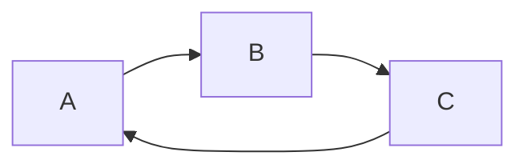
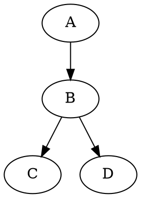

What Markdown extensions render in GitHub?
==========================================

This markdown file uses a whole bunch of extensions.  Specifically those documented by [Markdown Preview Enhanced](https://shd101wyy.github.io/markdown-preview-enhanced/#/), a plugin for VSCode and Atom.  Viewing this document on GitHub should answer the question: "what markdown extensions work in GitHub?"

A fenced code block (golang):
```go
// example golang code
package example

func myfunc(x int) error {
    return nil
}
```
----
## Math Typesetting
(with KaTeX or MathJax)
### Inline Render

Some text with $f(x) = sin(x^2) + 3x^3$ in the middle.

### Block Render

$$\int_{-\infty}^\infty e^{-x^2} = \sqrt{\pi}$$

----
## Diagrams

### Flow Charts
using: [flowchart.js](https://flowchart.js.org)

```flow
st=>start: Start
cond=>condition: Yes or No?
work=>operation: do Work
e=>end

st->cond
cond(yes)->e
cond(no)->work
work->e
```

### Sequence Diagram 
using: [js-sequence-diagrams](https://bramp.github.io/js-sequence-diagrams/)

```sequence {theme="hand"}
A -> B: request
B --> A: response
```

### Mermaid
using: [mermaid](https://github.com/knsv/mermaid)



### PlantUML
using: [PlantUML](https://plantuml.com/)

```puml
actor Alice
Alice -> A: Start
activate A

A -> B: request
B --> A: response

A -> Alice: Complete
deactivate A
```

### WaveDrom
using: [WaveDrom](https://wavedrom.com/)

```wavedrom
{ signal: [{ name: "Alpha", wave: "01.zx=ud.23.456789" }] }
```

### GraphViz
using: [viz.js](https://github.com/mdaines/viz.js)



### Vega
using [Vega](https://vega.github.io/vega/)

```vega-lite
{
  "$schema": "https://vega.github.io/schema/vega-lite/v5.json",
  "description": "A simple bar chart with embedded data.",
  "data": {
    "values": [
      {"a": "A", "b": 28}, {"a": "B", "b": 55}, {"a": "C", "b": 43},
      {"a": "D", "b": 91}, {"a": "E", "b": 81}, {"a": "F", "b": 53},
      {"a": "G", "b": 19}, {"a": "H", "b": 87}, {"a": "I", "b": 52}
    ]
  },
  "mark": "bar",
  "encoding": {
    "x": {"field": "a", "type": "nominal", "axis": {"labelAngle": 0}},
    "y": {"field": "b", "type": "quantitative"}
  }    
}
```
